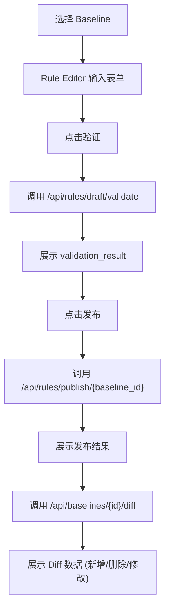

## 1. 产品概述
构建一个最小可运行前端（MVP）的 Rule Editor UI，用于验证规则的发布与比对（Publish + Diff）功能。
- 该工具旨在为开发和业务人员提供一个直观的界面，用于编辑规则、验证草稿、发布新版本基线，以及查看基线变更差异。
- 核心价值在于打通规则编辑到发布的流程，并可视化展示规则的修改情况，所有数据均来自后端 API，前端仅作展示和交互。

## 2. 核心功能

### 2.1 角色（如果适用）
暂无复杂的角色区分，所有用户均可进行规则编辑和发布。

### 2.2 功能模块
1. **Baseline 列表模块**：展示可用的基线版本（MVP 阶段可简单 Mock），供用户选择和切换。
2. **Rule Editor 模块**：提供表单输入（rule_type + params），调用验证 API 并展示验证结果及发布功能。
3. **Diff 面板模块**：展示选中基线的规则差异，包括新增规则、删除规则和修改的规则（含具体修改字段及 Evidence）。

### 2.3 页面详情
| 页面名称 | 模块名称 | 功能描述 |
|-----------|-------------|---------------------|
| 工作台 | Baseline 列表 | 左侧边栏，展示基线列表，支持点击切换当前基线 |
| 工作台 | Rule Editor | 中间主区域，包含规则类型和参数的输入表单，提供“验证”和“发布”按钮，并展示 API 返回的 validation_result 和发布结果（版本号 + summary） |
| 工作台 | Diff 面板 | 右侧边栏，展示目标基线的 diff 结果，分类展示 added_rules、removed_rules、modified_rules（含 changed_fields）以及原样展示的 Evidence |

## 3. 核心流程
用户首先在左侧选择基线。接着在中间的 Rule Editor 中输入规则内容并点击验证，验证通过后点击发布。发布完成后，右侧的 Diff 面板会刷新并展示该基线相关的规则差异。

## 4. 用户界面设计
### 4.1 设计风格
- 主色调和次色调：基于 Ant Design 的默认蓝白灰简约企业级风格。
- 按钮风格：Ant Design 默认的圆角矩形按钮。
- 字体与字号：系统默认的无衬线字体，字号 14px 为主。
- 布局风格：经典的三栏布局（左侧列表、中间编辑区、右侧 Diff 面板），使用 Flex 或 Grid 布局。
- 图标/Emoji：使用 Ant Design Icons。

### 4.2 页面设计概览
| 页面名称 | 模块名称 | UI 元素 |
|-----------|-------------|-------------|
| 工作台 | Baseline 列表 | 列表组件 (List)、高亮当前选中项 |
| 工作台 | Rule Editor | 表单 (Form)、输入框 (Input)、下拉框 (Select)、按钮 (Button)、结果提示 (Alert) |
| 工作台 | Diff 面板 | 卡片 (Card)、折叠面板 (Collapse)、标签 (Tag)、差异对比高亮文本 |

### 4.3 响应式要求
- 优先满足桌面端体验，确保三栏布局在宽屏下能够合理分配空间（如 2:5:3 的比例）。