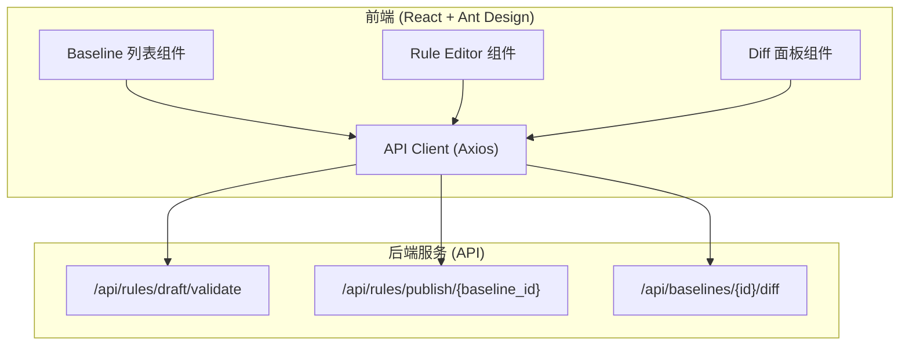

## 1. 架构设计


## 2. 技术说明
- 前端框架：React@18 + TypeScript
- UI 组件库：Ant Design
- 网络请求：Axios
- 构建工具：Vite
- 状态管理：React Hooks (useState, useEffect)

## 3. 路由定义
由于是 MVP，暂不涉及复杂路由，主要在单页完成。
| 路由 | 用途 |
|-------|---------|
| / | 主工作台页面，包含三栏布局 |

## 4. API 定义
前端 Axios 需要对接的接口定义：

```typescript
// 验证规则草稿
// POST /api/rules/draft/validate
interface ValidateRequest {
  rule_type: string;
  params: Record<string, any>;
}
interface ValidateResponse {
  validation_result: {
    valid: boolean;
    errors?: string[];
    evidence?: any;
  };
}

// 发布规则
// POST /api/rules/publish/{baseline_id}
interface PublishResponse {
  version: string;
  summary: string;
}

// 获取基线差异
// GET /api/baselines/{id}/diff
interface DiffResponse {
  added_rules: any[];
  removed_rules: any[];
  modified_rules: Array<{
    rule_id: string;
    changed_fields: Record<string, any>;
    evidence?: any;
  }>;
}
```

## 5. 组件划分
1. **App (根组件)**：负责整体三栏布局。
2. **BaselineList (左栏)**：Mock 数据并渲染可选的基线列表。
3. **RuleEditor (中栏)**：
   - RuleForm (输入表单)
   - ValidationResult (验证结果展示)
   - PublishAction (发布操作及结果展示)
4. **DiffPanel (右栏)**：
   - AddedRulesList
   - RemovedRulesList
   - ModifiedRulesList (支持 changed_fields 差异对比和 Evidence 渲染)