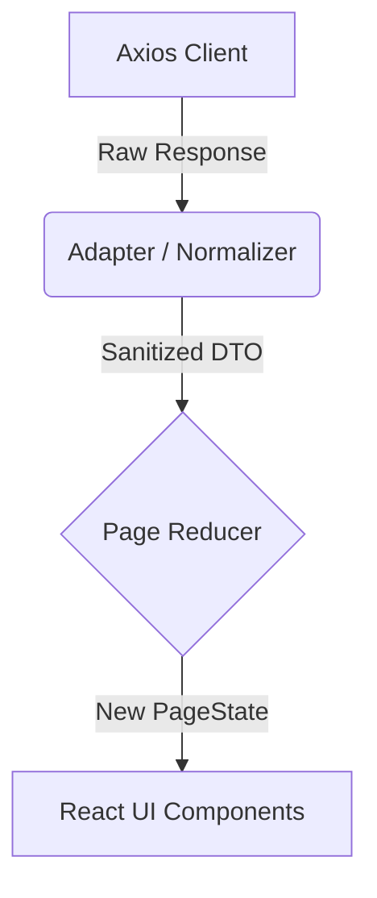

# API Integration Checklist

This document tracks the integration status between the frontend Rule Editor MVP and the real backend API.

## Environment & Dual Channel Setup
- **Environment Variable**: `VITE_USE_MOCK_API=true` (defaults to true)
- **Real API Base URL**: `VITE_API_BASE_URL` (defaults to `/api`)
- **Strategy**: The UI strictly consumes Normalized DTOs. If the real backend fails or returns unexpected structures, the adapter layer (`src/api/adapters.ts`) is responsible for sanitizing or throwing explicit errors, protecting the UI Reducer.

## 1. Read-Only Interfaces (Phase 1)

| Interface | API Route | Adapter | Status | Known Gaps / Risks |
|-----------|-----------|---------|--------|--------------------|
| **Baseline Tree** | `GET /baselines` | `normalizeBaselineTreeResponse` | 🟡 Ready for real API | Needs to verify if backend provides nested tree structure or flat list. Adapter currently assumes flat list and UI mocks nested tree. |
| **Version Detail** | `GET /baselines/{id}/versions/{v}` | `normalizeVersionDetailResponse` | 🟡 Ready for real API | UI relies on `publisher` and `published_at` which might be missing in real backend. Adapter provides fallbacks. |
| **Validation** | `POST /rules/draft/validate` | `normalizeValidationResponse` | 🟡 Ready for real API | **High Risk**: Adapter handles both flat `{valid, issues}` and nested `{validation_result: {valid, errors}}`. If backend does not provide `field_path`, UI jump-to-field feature will degrade. |
| **Diff** | `GET /baselines/{id}/diff` | `normalizeDiffResponse` | 🟡 Ready for real API | Adapter normalizes both flat `rules` array and old split `added_rules / modified_rules` formats. Needs real payload to confirm structure. |

## 2. Write Interfaces (Phase 2)

| Interface | API Route | Adapter | Status | Known Gaps / Risks |
|-----------|-----------|---------|--------|--------------------|
| **Publish** | `POST /rules/publish/{id}` | `normalizePublishResponse` | 🟡 Ready for real API | **High Risk**: Needs to ensure backend HTTP 400 responses include `blocked_issues` with `field_path` so the UI can display the `publish_blocked` state properly. |
| **Create Rollback** | `POST /rules/rollback` | `normalizeRollbackCandidateResponse` | 🟡 Ready for real API | Adapter ensures `draft_data` and `source_version_id` are extracted. Real backend must return the hydrated draft rule configuration, not just an empty success. |
| **Discard Rollback** | None | N/A | 🟢 Fully Local | Currently purely local frontend state discard (`DISCARD_ROLLBACK_CANDIDATE`). If backend tracks draft states persistently, a `DELETE /drafts` API must be added. |
| **Save Draft** | None (Mocked) | N/A | 🔴 Missing | Save is currently a simulated `setTimeout`. Needs a real `PUT /rules/draft` API. |

## Data Flow

## Error Handling & Fallbacks
- **Empty Values**: Adapters provide safe defaults (e.g. `unknown-id`, `[]` for arrays).
- **Validation Fallback**: If backend issues string errors instead of objects, adapter wraps them in a `{ field_path: 'unknown', message: string }` object to prevent UI crashes.
- **Publish Blocked**: `normalizePublishResponse` checks for `success === false` and maps `blocked_issues`. If backend uses standard HTTP 400 without specific JSON, the UI will fall back to a generic error toast instead of the detailed blocked view.